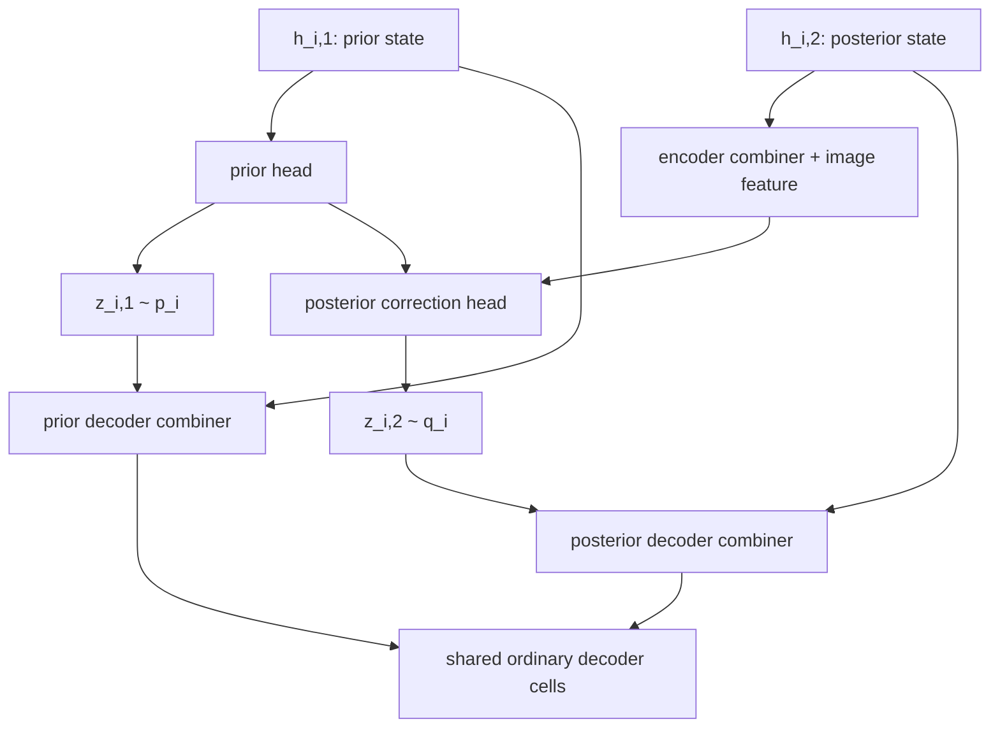

# 双 Decoder 特征路径：共享 Cell、分离状态的层级推断

## 1. 设计目标

原始 NVAE 在推断时只有一条 top-down 特征路径：条件先验头、Encoder Combiner、后验头和 Decoder Combiner 都围绕同一个特征状态运行。该实现增加一个可选的双路径模式，使条件后验不再完全依赖同一条 top-down 特征轨迹。

开启方式：

```bash
python train.py ... --res_dist --dual_decoder_paths
```

`--dual_decoder_paths` 必须与 `--res_dist` 一起使用，因为本模式把后验头输出明确解释为相对于条件先验参数的修正量。不开启该选项时，模型保持原始 NVAE 行为。

## 2. 变量与模块

对第 (i) 个 latent group，使用两套互不共享的运行时特征：

|分支|进入 group 的特征|注入 latent 后的特征|latent|
|---|---|---|---|
|条件先验/生成分支|\(h_{i,1}\)|\(d_{i,1}\)|\(z_{i,1}\sim p_i\)|
|条件后验/重构分支|\(h_{i,2}\)|\(d_{i,2}\)|\(z_{i,2}\sim q_i\)|

两条路径的状态张量不共享。它们从同一个可学习的 `prior_ftr0` 值开始，但后验路径使用 `clone()` 建立独立特征张量；第一组注入不同的 latent 后，两条轨迹立即分离。

模块参数的关系如下：

|模块|参数关系|输入分支|
|---|---|---|
|条件先验头 `dec_sampler[i]`|仅一套|\(h_{i,1}\)|
|Encoder Combiner|仅后验使用|图像特征与 \(h_{i,2}\)|
|后验修正头 `enc_sampler[i]`|仅一套|融合特征|
|Prior Decoder Combiner|先验分支独立参数|\((h_{i,1},z_{i,1})\)|
|Posterior Decoder Combiner|后验分支独立参数|\((h_{i,2},z_{i,2})\)|
|普通 Decoder Cell（`normal_dec`、`up_dec`）|**两条分支严格共享同一模块参数**|分别作用于 \(d_{i,1}\) 与 \(d_{i,2}\)|
|post-process 与输出头|仅重构末端使用|后验分支最终特征|

这里的“Cell 参数共享”不是复制后再同步，而是同一个 PyTorch 模块先后接收两个不同的输入，因此梯度会共同更新唯一一套权重。

## 3. 单个 group 的微观计算

### 3.1 条件先验分支

对除最顶层以外的 group：

\[
(\mu_{p,i},\log\sigma_{p,i})=P_i(h_{i,1}),
\qquad z_{i,1}\sim p_i=\mathcal N(\mu_{p,i},\sigma_{p,i}^2).
\]

先验 Decoder Combiner 注入该先验样本：

\[
d_{i,1}=C^{p}_i(h_{i,1},z_{i,1}).
\]

### 3.2 条件后验分支

令 (e_i(x)) 为与当前 group 对齐的 bottom-up 图像特征。Encoder Combiner 融合图像信息与**后验路径自己的** top-down 状态：

\[
f_i=E_i(e_i(x),h_{i,2}).
\]

后验头预测修正量：

\[
(\Delta\mu_i,\Delta\log\sigma_i)=Q_i(f_i),
\]

并用条件先验参数形成 residual posterior：

\[
q_i=\mathcal N\!\left(
\mu_{p,i}+\Delta\mu_i,
\exp\{2(\log\sigma_{p,i}+\Delta\log\sigma_i)\}
\right),
\qquad z_{i,2}\sim q_i.
\]

后验 Decoder Combiner 注入后验样本：

\[
d_{i,2}=C^{q}_i(h_{i,2},z_{i,2}).
\]

### 3.3 共享普通 Decoder Cell

令 (B_i(\cdot;\theta_i)) 表示该 group 后的普通 Decoder Cell 序列。两条路径使用同一个参数对象 \(\theta_i\)：

\[
h_{i+1,1}=B_i(d_{i,1};\theta_i),
\qquad
h_{i+1,2}=B_i(d_{i,2};\theta_i).
\]

因此共享的是映射规则，不是中间特征。



图中的共享 Cell 在代码中会被调用两次，分别返回下一组的 `prior_s` 与 `posterior_s`。

## 4. 最顶层与 normalizing flow

最顶层维持 NVAE 的约定：

- (p_0=\mathcal N(0,I))；
- (q_0) 由最顶部 encoder 特征直接参数化；
- 分别采样 (z_{0,1}\sim p_0) 和 (z_{0,2}\sim q_0)，再注入各自的 Decoder Combiner。

若启用 normalizing flow，flow 只变换后验样本 (z_{i,2})，与原始 NVAE 一致；先验轨迹使用未经过 flow 的 (z_{i,1}\)。

## 5. 训练目标及其性质

重构项仅由后验路径的最终特征计算：

\[
\mathcal L_{\mathrm{rec}}
=-\mathbb E_{q}\big[\log p_\theta(x\mid z_{1:L,2})\big].
\]

每组代码计算：

\[
K_i=D_{\mathrm{KL}}\!\left[
q_i(\cdot\mid e_i,h_{i,2};\mu_{p,i},\sigma_{p,i})
\,\|\,
p_i(\cdot\mid h_{i,1})
\right].
\]

没有 flow 时使用 Normal KL 闭式；有 flow 时在后验样本 (z_{i,2}) 上计算 `log_q - log_p`。训练器仍按原有 KL balancing 与 annealing 规则组合：

\[
\mathcal J=\mathcal L_{\mathrm{rec}}+
\sum_i \beta_i K_i+	ext{regularization}.
\]

### 重要说明：这通常不是标准层级 VAE 的严格 ELBO

标准层级 ELBO 中，(p(z_i\mid z_{<i})) 与 (q(z_i\mid x,z_{<i})) 应在同一组祖先样本 (z_{<i}) 上比较。双路径模式让条件先验参数依赖独立先验祖先轨迹 (z_{<i,1})，而后验状态依赖后验祖先轨迹 (z_{<i,2})。因此上式是一个具有明确逐组 KL 形式的训练目标，但一般不能再直接解释为原始生成模型对数似然的严格下界。

这一区别是设计本身带来的，而不是实现误差。若实验必须保持严格 ELBO，应让先验头在后验祖先轨迹上求值；那会退回原始 NVAE 的共享 top-down 状态语义。

## 6. 生成路径

`model.sample()` 不需要图像与后验分支，只执行：

1. 从最顶层标准 Normal 采样；
2. 用 `dec_sampler` 根据 `prior_s` 生成后续条件先验；
3. 用 prior Decoder Combiner 注入 (z_{i,1})；
4. 经过共享普通 Decoder Cell；
5. 进入原有 post-process 与图像输出头。

因此新增后验路径不会改变模型纯生成时的拓扑。

## 7. 代码映射与兼容性

- `model.py`
  - `dual_decoder_paths`：模式开关；旧 checkpoint 缺少该字段时自动视为 `False`。
  - `posterior_dec_combiners`：后验分支专用的 Decoder Combiner。
  - `prior_s` / `posterior_s`：两套独立运行时状态。
  - `z_prior` / `z_posterior`：两套独立样本。
- `train.py`
  - 新增 `--dual_decoder_paths`。
- 默认模式的模块和前向逻辑保持原样；仅显式开启开关时增加后验 Decoder Combiner 参数并运行双路径。

旧的单路径 checkpoint 可继续按默认模式加载。双路径 checkpoint 必须使用保存时相同的 `--dual_decoder_paths` 配置。

